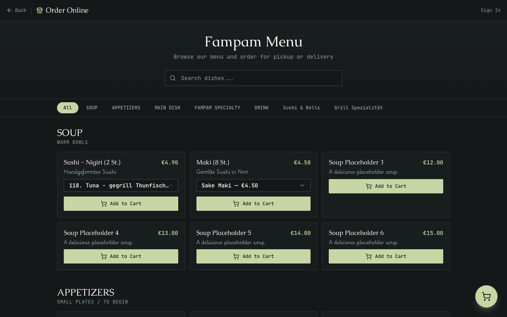
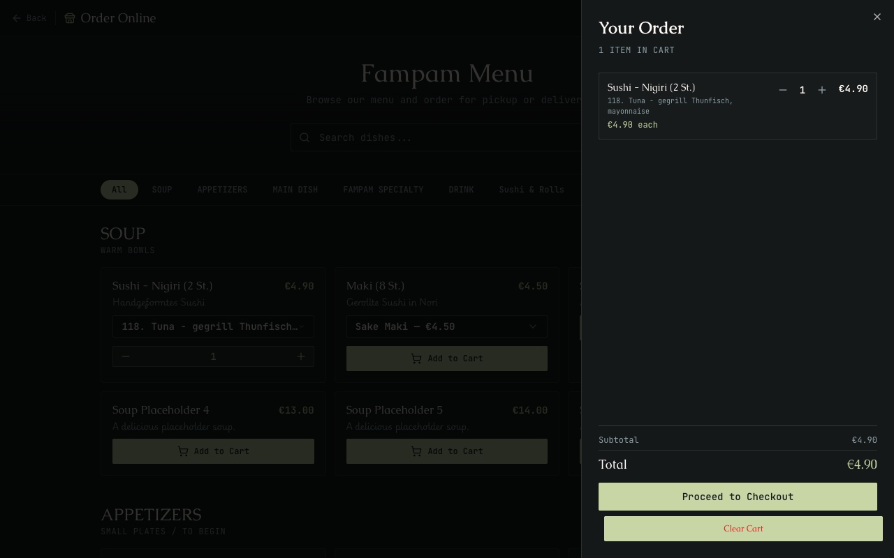
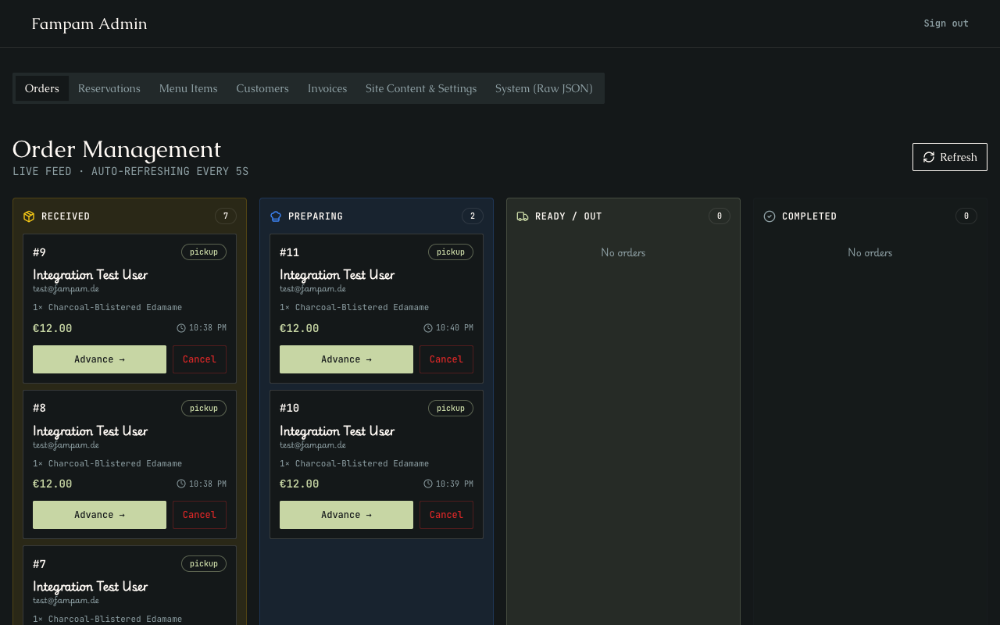

# Fampam POS & Online Ordering System

Welcome to the documentation for the Fampam Point of Sale (POS) and online ordering system. This system bridges a seamless customer ordering experience with a robust administrator portal.

## 1. Architecture

This project is built using a modern **Edge-first Architecture**:

- **Frontend:** A Single Page Application (SPA) built with React and Vite. It utilizes TailwindCSS for styling and shadcn/ui for accessible components.
- **Backend (API):** Cloudflare Workers using the [Hono](https://hono.dev/) framework. The backend routes API requests under `/api` and serves the React SPA statically as a fallback.
- **Database:** Cloudflare D1, a highly distributed serverless SQLite database, providing extremely low-latency reads globally.
- **State Management:** Zustand is used on the client side for persistent cart management and authentication state, while `@tanstack/react-query` handles data fetching and caching.

## 2. Dependencies

### Frontend Core
- `react`, `react-dom`, `react-router-dom`: UI and routing.
- `zustand`: Global state management (Cart, Auth, Settings).
- `@tanstack/react-query`: Server state synchronization and polling.
- `@stripe/stripe-js`: Secure client-side Stripe integration.
- `tailwindcss`, `lucide-react`, `framer-motion`: Design and animations.

### Backend Core
- `hono`: Fast, lightweight edge web framework.
- `stripe`: Server-side Stripe SDK for creating checkout sessions.
- `bcryptjs`: Secure password hashing for customer accounts.

## 3. Data Flow and Schema

The application stores data inside Cloudflare D1 via the following core tables:

- **`collections` & `dishes` (The CMS)**: Represents the menu. Collections group dishes (e.g., Soups, Main Dishes). Dishes contain pricing, variants (stored as JSON arrays), dietary markers, and spice levels.
- **`customers`**: Stores authenticated user accounts for the POS. Contains `name`, `email`, `password_hash`, and order history metadata.
- **`orders`**: The core transactional entity. Tracks `customer_id` (or guest data), `type` (delivery/pickup), `status` (received, preparing, ready, completed), JSON `items`, pricing totals, and `stripe_session_id`.
- **`invoices`**: Maps generated PDF invoices to a specific `order_id`.
- **`site_settings`**: Global store settings like toggling offline mode, managing delivery fees, hero images, and contact info.

### Sync Mechanism
The frontend `OrderMenu` is fully synchronized with the CMS. When an admin updates a dish inside the `LiveEditor` (Admin Dashboard), the React App makes a `POST /admin/menu/dishes` request, modifying the D1 database instantly. Next time a customer loads the `/order` page, `useMenu()` fetches the latest `is_published` dishes via `/api/menu`, ensuring perfect parity without a build step.

## 4. Third-Party Integrations Needed

To fully operate this system in production, ensure the following environment variables are set in your Cloudflare `wrangler.toml` or secret store:

1. **Stripe:** 
   - `STRIPE_PUBLIC_KEY` & `STRIPE_SECRET_KEY`: Used to generate secure checkout sessions for delivery and pickup.
   - `STRIPE_WEBHOOK_SECRET`: (Optional) To automatically update order status to 'paid' when Stripe triggers the success webhook.
2. **Cloudflare Access (Zero Trust):**
   - The `/admin/*` routes are protected natively at the network edge by Cloudflare Access. Admins must authenticate via Email OTP or Google/GitHub before the Worker executes.
3. **Notifications (Email / SMS):**
   - **Resend:** (`RESEND_API_KEY`) Used to send beautiful HTML order confirmations and reservation emails.
   - **Twilio:** (`TWILIO_ACCOUNT_SID`, etc.) Used to ping the Admin via WhatsApp when a new order drops.
4. **Cloudflare R2:**
   - Image assets uploaded via the Admin CMS are stored in an R2 Bucket and served globally.

## 5. Typical User Flow

### Actor 1: The Customer
1. **Browse:** Lands on `/order`. The frontend pulls `useMenu()` from D1.
   
   

2. **Select:** Clicks "Add to Cart" on a `ProductCard`. Chooses variants (e.g., Tofu vs. Chicken) if applicable.
3. **Cart Management:** The `CartFAB` animates. The user opens the `CartDrawer` to adjust quantities. Zustand persists this in local storage.

   

4. **Checkout:** User navigates to `/checkout`. They select **Pickup** or **Delivery**. If delivery, a dynamic fee is appended.
5. **Auth (Optional):** User can log in or proceed as a Guest.

   

6. **Payment:** User hits "Pay with Stripe". The backend generates a Stripe Checkout Session and redirects the user.
7. **Success:** User is bounced back to `/order/success`. They can track their order status via their account dashboard.

### Actor 2: The Administrator
1. **Edge Auth:** Admin tries to hit `/admin`. Cloudflare intercepts the request and prompts for OTP login.
2. **Live Operations:** Admin opens the Dashboard and switches to the **Orders** tab. React-query polls `/api/admin/orders` every 10 seconds.

   

3. **Fulfillment:** A new order pops up. Admin reviews it, clicks "Accept," and begins cooking. The order status shifts from `received` to `preparing`.
4. **CMS Management:** Admin switches to the **Settings** tab. They realize the kitchen is overwhelmed, so they toggle the "Store Offline" setting to prevent new online orders temporarily.
5. **Menu Updates:** Admin notices an item is out of stock. They go to the Menu Editor, toggle `is_published` to false, and the item instantly disappears from the customer-facing `/order` page.
